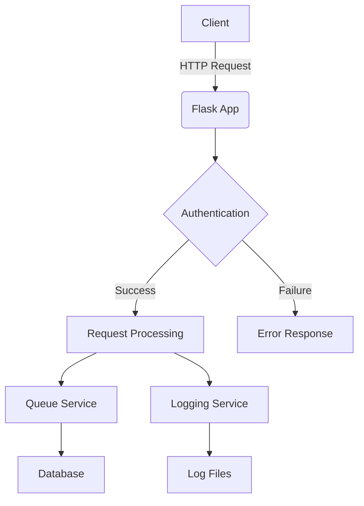
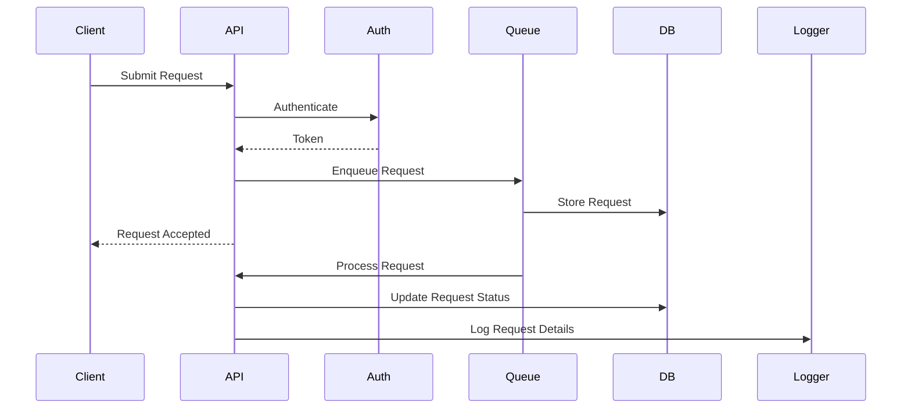

# Secure Request Processing API

A Flask-based API for secure request processing, featuring authentication, request queuing, and logging capabilities.

## Features

- Secure authentication system
- Request queuing and processing
- Detailed logging of requests and system events
- Database integration for storing request data
- API endpoints for submitting requests and retrieving logs

## Project Structure

```
secure-request-processing-api/
├── app/
│   ├── models/
│   │   └── request.py
│   ├── routes/
│   │   ├── logs.py
│   │   └── main.py
│   ├── services/
│   │   └── queue_service.py
│   ├── utils/
│   │   └── auth.py
│   └── __init__.py
├── instance/
│   └── main.db
├── logs/
│   ├── app.log
│   ├── app.log.1
│   └── app.log.2
├── migrations/
│   ├── versions/
│   │   ├── 8088d79cdb17_initial_migration.py
│   │   └── 7676022b80b0_request_query_field_changed_to_user_.py
│   ├── alembic.ini
│   ├── env.py
│   ├── README
│   └── script.py.mako
├── .env
├── config.py
├── requirements.txt
├── run.py
└── README.md
```

## Installation

1. Clone the repository:
   ```
   git clone https://github.com/yourusername/secure-request-processing-api.git
   cd secure-request-processing-api
   ```

2. Create a virtual environment and activate it:
   ```
   python -m venv venv
   source venv/bin/activate  # On Windows, use `venv\Scripts\activate`
   ```

3. Install the required packages:
   ```
   pip install -r requirements.txt
   ```

4. Set up the database:
   ```
   flask db upgrade
   ```

## Configuration

1. Create a `.env` file in the project root and add the following variables:
   ```
   SECRET_KEY=your_secret_key
   DATABASE_URI=sqlite:///instance/main.db
   ```

2. Adjust other configuration options in `config.py` as needed.

## Usage

To run the API server:

```
python run.py
```

The API will be available at `http://localhost:5000`.

## API Endpoints

- `POST /api/request`: Submit a new request
- `GET /api/logs`: Retrieve logs (requires authentication)

For detailed API documentation, refer to the API specification document.

## Authentication

Authentication is handled using JWT (JSON Web Tokens). To access protected endpoints, include the JWT token in the Authorization header of your request:

```
Authorization: Bearer <your_jwt_token>
```

## Database

The project uses SQLite as the database backend. The database file is located at `instance/main.db`.

## Logging

Application logs are stored in the `logs/` directory. The logging system uses a rotating file handler to manage log files.

## Project Architecture



## Request Flow



## Contributing

1. Fork the repository
2. Create your feature branch (`git checkout -b feature/AmazingFeature`)
3. Commit your changes (`git commit -m 'Add some AmazingFeature'`)
4. Push to the branch (`git push origin feature/AmazingFeature`)
5. Open a Pull Request

## License

This project is licensed under the MIT License - see the [LICENSE](LICENSE) file for details.