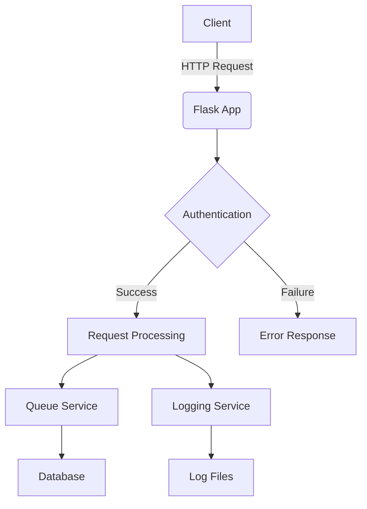
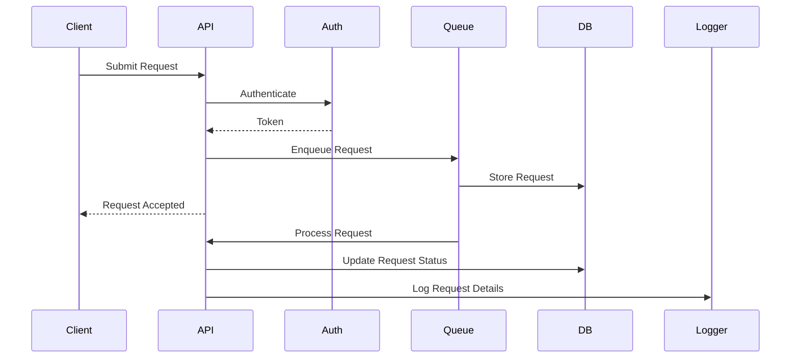

# Secure Request Processing API

A Flask-based API for secure request processing, featuring authentication, request queuing, and logging capabilities.

## Features

- Secure authentication system
- Request queuing and processing
- Detailed logging of requests and system events
- Database integration for storing request data
- API endpoints for submitting requests and retrieving logs

## Project Structure

```
secure-request-processing-api/
├── app/
│   ├── models/
│   ├── routes/
│   ├── services/
│   ├── utils/
│   └── __init__.py
├── instance/
├── logs/
├── migrations/
├── .env
├── config.py
├── requirements.txt
├── run.py
└── README.md
```

## Installation and Setup

1. Clone the repository:
   ```
   git clone https://github.com/ParsaZa79/secure-request-processing-api.git
   cd secure-request-processing-api
   ```

2. Set up a virtual environment and install dependencies:
   ```
   python -m venv venv
   source venv/bin/activate  # On Windows, use `venv\Scripts\activate`
   pip install -r requirements.txt
   ```

3. Configure the environment:
   - Create a `.env` file in the project root with the following variables:
     ```
     DATABASE_URL=sqlite:///yourdb.db
     OAUTH_CLIENT_ID=your_oauth_client_id
     OAUTH_CLIENT_SECRET=your_oauth_client_secret
     RABBITMQ_HOST=rabbitmq
     RABBITMQ_PORT=5672
     RABBITMQ_USER=your_rabbitmq_user
     RABBITMQ_PASS=your_rabbitmq_password
     ```
   - Adjust other configuration options in `config.py` as needed.

4. Set up the database:
   ```
   flask db upgrade
   ```

## Usage

To run the API server:

```
python run.py
```

The API will be available at `http://localhost:5000`.

## Docker Deployment

1. Ensure Docker and Docker Compose are installed.

2. Build and start the containers:
   ```
   docker-compose up --build
   ```

3. To stop the containers:
   ```
   docker-compose down
   ```

Note: Ensure your `.env` file is properly configured before running Docker containers.

## API Endpoints


### Request Management
- `POST /submit-request`
  - Description: Submit a new request for processing
  - Authentication: Requires OAuth authentication
  - Request Body: JSON object with `query` field (string)
  - Response: JSON object with `request_id` (integer)

- `GET /fetch-requests`
  - Description: Fetch the latest queued request
  - Authentication: Requires OAuth authentication
  - Response: JSON object with `request_id` (integer) and `query` (string), or a 404 message if queue is empty

- `POST /submit-result`
  - Description: Submit the result for a processed request
  - Authentication: Requires OAuth authentication
  - Request Body: JSON object with `request_id` (integer) and `result` (string)
  - Response: Success message or 404 if request not found

- `GET /get-result/<int:request_id>`
  - Description: Get the result of a specific request
  - Authentication: Requires OAuth authentication
  - Path Parameter: `request_id` (integer)
  - Response: JSON object with `result` (string) and `status` (string), or 404 if not found

### Log Management
- `GET /logs`
  - Description: Retrieve application logs
  - Authentication: Requires OAuth authentication
  - Response: JSON array of log entries

- `GET /logs/download`
  - Description: Download application logs as a file
  - Authentication: Requires OAuth authentication
  - Response: File download (app.log)

All endpoints are secured with OAuth authentication. Detailed request/response schemas and error responses are documented in the Swagger UI, accessible via the `/apidocs` endpoint.
For detailed API documentation, visit the `/apidocs` endpoint to access the Swagger UI.

## Authentication

This API supports two authentication methods: JWT (JSON Web Tokens) and OAuth2 (Google).

### JWT Authentication

Use JWT for authentication by including the JWT token in the Authorization header:

```
Authorization: Bearer <your_jwt_token>
```

JWT tokens can be obtained after successful authentication. They are stateless and contain encoded user information.

### OAuth2 Authentication

OAuth2 authentication is implemented using Google's OAuth2 service. The authentication flow is as follows:

1. The client initiates the OAuth2 flow by redirecting to Google's authentication page.
2. After successful authentication, Google provides an access token.
3. Include this access token in the Authorization header for subsequent requests:

```
Authorization: Bearer <your_oauth2_token>
```

### Authentication Flow

1. The `oauth_required` decorator in `auth.py` checks for the presence of an Authorization header.
2. It first attempts to validate the token as a JWT using `verify_jwt_in_request()`.
3. If JWT validation fails, it then tries to validate the token as an OAuth2 token by making a request to Google's userinfo endpoint.
4. If both validations fail, the request is denied with a 401 Unauthorized response.

### Swagger Configuration

The API documentation is configured with Swagger UI, supporting both JWT and OAuth2 authentication methods:

- JWT is configured as a Bearer token in the `securityDefinitions`.
- OAuth2 is set up with Google as the provider, including necessary URLs and scopes.

Developers can test the API directly from the Swagger UI using either authentication method.

To access the Swagger UI and detailed API documentation, visit the `/apidocs` endpoint.

## Project Architecture



## Request Flow



## Contributing

1. Fork the repository
2. Create your feature branch (`git checkout -b feature/AmazingFeature`)
3. Commit your changes (`git commit -m 'Add some AmazingFeature'`)
4. Push to the branch (`git push origin feature/AmazingFeature`)
5. Open a Pull Request

## License

This project is licensed under the MIT License - see the [LICENSE](LICENSE) file for details.